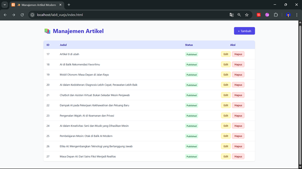
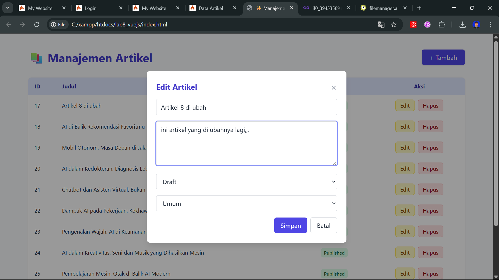
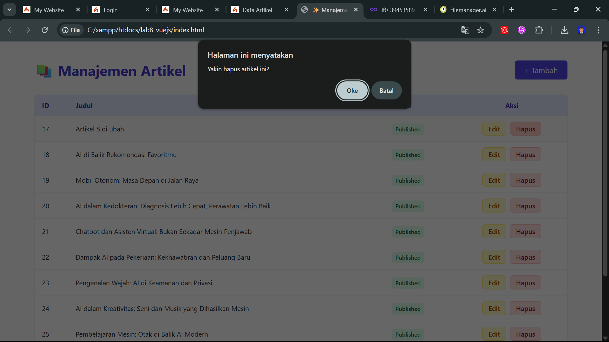

# 🧪 Praktikum 11: VueJS

## 👨‍🎓 Identitas

- **Nama**: Asep Jelpa Nasution
- **NIM**: 312310023
- **Kelas**: TI.23.C1
- **Mata Kuliah**: Pemrograman Web 2
- **Dosen Pengampu**: Agung Nugroho, S.Kom., M.Kom
- **Universitas**: Universitas Pelita Bangsa

---

## 🎯 Tujuan Praktikum

1. Memahami konsep dasar **API**.
2. Memahami dasar penggunaan **Framework VueJS 3**.
3. Mampu membuat **Frontend API** menggunakan VueJS secara manual (tanpa NPM).

---

## 🗂️ Struktur Direktori Proyek

```
lab11_vuejs/
│   index.html
└───assets/
    ├───css/
    │   └── style.css
    └───js/
        └── app.js
```

---

## 🛠️ Langkah Praktikum

### 1. Setup Awal

- Tambahkan library Vue 3 & Axios dari CDN pada `index.html`.

```html
<script src="https://unpkg.com/vue@3/dist/vue.global.js"></script>
<script src="https://unpkg.com/axios/dist/axios.min.js"></script>
```

- Buat file `style.css` dan `app.js` di folder `assets`.

---

### 2. Menampilkan Daftar Artikel dari API

- Isi awal file `app.js`:

```js
const { createApp } = Vue;
const apiUrl = "http://localhost/labci4/public";

createApp({
  data() {
    return {
      artikel: "",
    };
  },
  mounted() {
    this.loadData();
  },
  methods: {
    loadData() {
      axios
        .get(apiUrl + "/post")
        .then((response) => {
          this.artikel = response.data.artikel;
        })
        .catch((error) => console.log(error));
    },
    statusText(status) {
      if (!status) return "";
      return status == 1 ? "Publish" : "Draft";
    },
  },
}).mount("#app");
```

---

### 3. Tambah & Ubah Data Artikel (CRUD)

- Tambahkan tombol dan form dalam `index.html` menggunakan Vue `v-if`, `v-model`, dan event binding `@click`, `@submit.prevent`.

- Lengkapi metode Vue di `app.js`:
  - `tambah()` untuk reset form
  - `edit(data)` untuk ubah data
  - `hapus(index, id)` untuk delete
  - `saveData()` untuk tambah/update melalui POST/PUT ke endpoint API

---

### 4. Desain Tampilan (style.css)

- Tampilan responsive & nyaman menggunakan CSS:
  - Table dengan warna alternate row
  - Modal form untuk tambah/edit data
  - Tombol interaktif
  - Tampilan rapi dengan padding dan margin

---

## 🧪 Hasil Uji Coba

✅ Menampilkan daftar artikel  
✅ Tambah data artikel  
✅ Edit artikel  
✅ Hapus artikel  
✅ Semua aksi menggunakan Vue 3 + Axios ke endpoint REST API CodeIgniter 4

📸 **Screenshot Hasil**

> Tambahkan screenshot ke folder `img/` lalu panggil seperti ini:


### Tampil Daftar Artikel



### Form Tambah Artikel


### Form Edit Artikel



### Hapus Artikel




---

## 📦 Tools & Library

- Vue 3 CDN
- Axios CDN
- Web Server: XAMPP / PHP built-in
- Backend API: CodeIgniter 4

---

## ✅ Tugas & Pelaporan

1. Selesaikan langkah-langkah sesuai modul.
2. Lakukan screenshot untuk setiap fitur.
3. Tambahkan semua hasil ke dalam `README.md`.
4. Commit dan push ke repository **Lab11Web_VueJS**.
5. Kirim link repository ke e-learning.

---

📁 **Contoh Path File**

```
Lab11Web_VueJS/
│
├── index.html
├── README.md
├── assets/
│   ├── css/style.css
│   └── js/app.js
└── img/
    ├── list.png
    ├── form-tambah.png
    ├── form-edit.png
    └── hapus.png
```

---

📝 _Selesai. Praktikum 11 berhasil dijalankan menggunakan VueJS manual (tanpa NPM)._
